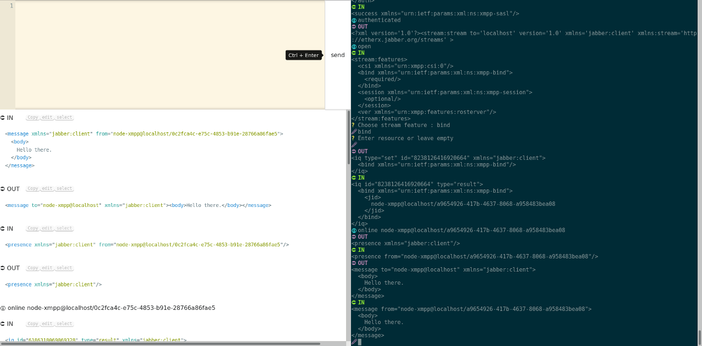

# console

XMPP console, terminal and web interfaces.



## Install

```
npm install -g @xmpp/console
```

## Usage

```
Usage
  $ xmpp-console [endpoint]

Options
  --port, -p 8080 port for the web interface
  --web, -w use web interface
  --no-open, prevents opening the url for the web interface
  --type, -t client (default) or component

Examples
  $ xmpp-console
  $ xmpp-console xmpp://localhost[:5222] (classic XMPP)
  $ xmpp-console xmpps://localhost[:5223] (direct TLS)
  $ xmpp-console ws://localhost:5280/xmpp-websocket (WebSocket)
  $ xmpp-console wss://localhost:52801/xmpp-websocket (Secure WebSocket)
  $ xmpp-console xmpp://component.localhost[:5347] --type component (component)
```

## Interfaces

### Terminal

The terminal interface supports component and client connection (TCP and WebSocket).

### Web

The Web interface only supports client WebSocket connection at the moment.

It is possible to use it locally see [Usage](#usage) or deploy it with

```
$ git clone https://github.com/node-xmpp/node-xmpp
$ cd node-xmpp
$ npm install
$ cd packages/console
$ make
```

and use your HTTP server to serve `node-xmpp/packages/console/public/`.
